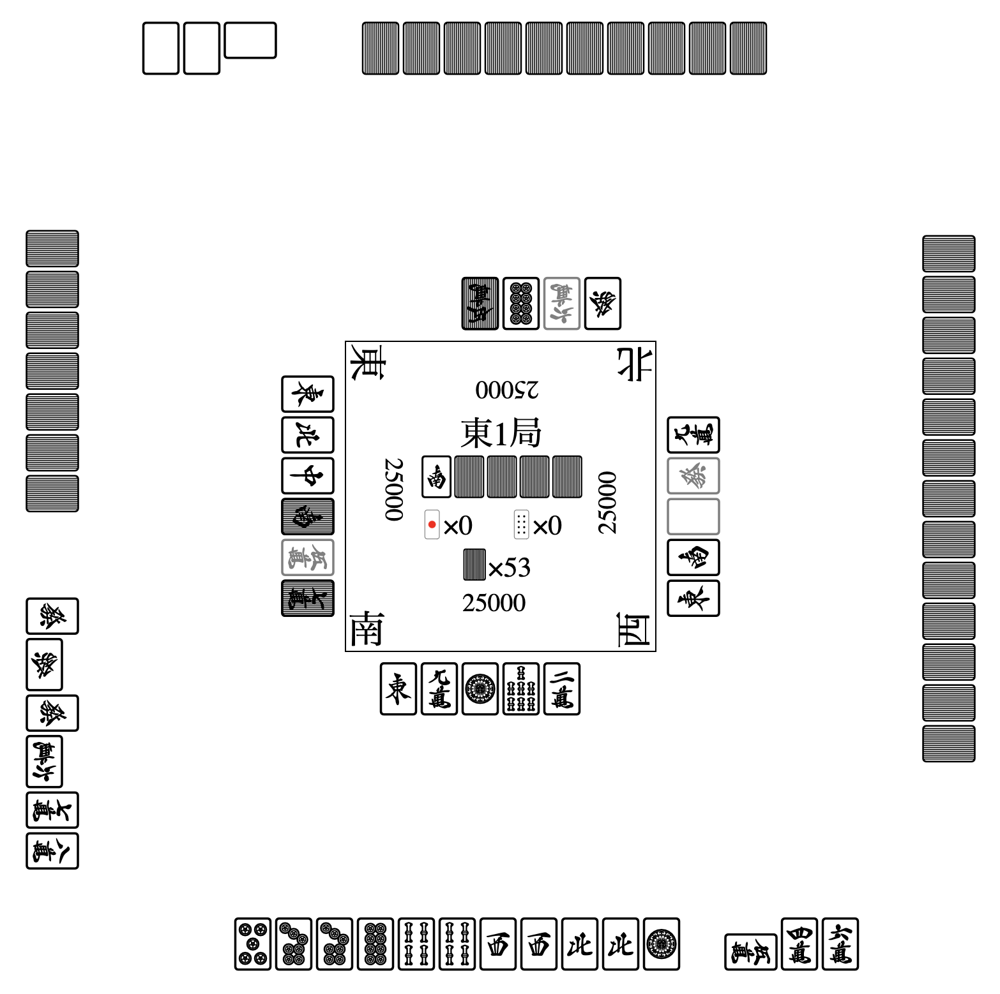

[](https://github.com/mjx-project/mjx/actions/workflows/ci.yml)

<!-- 
<p align="center">

</p>
-->
<!-- 
<p align="center"> 

</p>
-->
<p align="center"> 

</p>

⚠️ Currently Mjx build is broken. Also, Mjx API will change in the near future.

# Mjx

Mjx is a Japanese Mahjong (riichi Mahjong) simulator.
Mjx works as a game server as [Mjai](https://github.com/gimite/mjai), a popular Mahjong simulator, to evaluate Mahjong AIs but have additional features:

* **Fast** (100x faster than [Mjai](https://github.com/gimite/mjai))
* **Exact [Tenhou](https://tenhou.net/) compatibility**  (Mjx is validated with numerous Tenhou game logs)
* **Gym-like API** 
* **Easy distributed computing** (available for large-scale RL and evaluation thanks to [gRPC](https://github.com/grpc/grpc))
* **[Mjai](https://github.com/gimite/mjai) compatible** ([mjx_mjai_translater](https://github.com/mjx-project/mjx_mjai_translater))
* **Beautiful visualization** 

<p align="center"> 

</p>

## Quick start

[Google colab](https://colab.research.google.com/drive/1m1wOT_K2YFtuV6IO7VgWk4ilVhTKqRFU?usp=sharing)

## Install

```
$ pip install mjx
```

**Requirements.** Mjx supports `Python3.7` or later in `Linux` and `macOS Intel` (10.15 or later).
Currently `Windows` and `macOS Apple Silicon` are NOT supported.
Contributions for supporting `Windows` and `macOS Apple Silicon` are more than welcome!

## Example

```py
import mjx
from mjx.agents import RandomAgent

agent = RandomAgent()
env = mjx.MjxEnv()
obs_dict = env.reset()
while not env.done():
  actions = {player_id: agent.act(obs)
    for player_id, obs in obs_dict.items()}
  obs_dict = env.step(actions)
returns = env.rewards()
```

## Sever Usage

<table>
<tr><th>Server</th><th>Client</th></tr>

<tr>
<td>

```py
import random
import mjx

class RandomAgent(mjx.Agent):
  def __init__(self):
    super().__init__()

  # When you use neural network models
  # you may want to infer actions by batch
  def act_batch(self, observations):
    return [random.choice(obs.legal_actions()) 
            for obs in observations]


agent = RandomAgent()
# act_batch is called instead of act
agent.serve("127.0.0.1:8080", batch_size=8)
```

</td>
<td>

```py

import mjx

host="127.0.0.1:8080"

mjx.run(
  {f"player_{i}": host for i in range(4)},
  num_games=1000,
  num_parallels=16
)
```

</td>
</tr>
</table>

This sever usage uses gRPC. Thus, actually any programming language is available to develop your own Mahjong AI.
For Python, we provide a convinent wrapper `mjx.Agent.serve()`.

## Notes

Mjx is still under active development. APIs might change without notice before v1.0.
Especially,

* Default behavior of `env.rewards(reward_type)`and `env.done(done_type)`
* Protobuf schema
* Feature extraction APIs (currently, provided by `Observation.to_features()`)


## How to develop
We recommend you to develop Mjx inside a container.
Easiest way is open this repository from VsCode.
Feel free to mention to @sotetsuk if you have any questions.

## Citation

```
@INPROCEEDINGS{mjx2022,
  author={Koyamada, Sotetsu and Habara, Keigo and Goto, Nao and Okano, Shinri and Nishimori, Soichiro and Ishii, Shin},
  booktitle={2022 IEEE Conference on Games (CoG)}, 
  title={Mjx: A framework for Mahjong AI research}, 
  year={2022},
  volume={},
  number={},
  pages={504-507},
  doi={10.1109/CoG51982.2022.9893712}}
```

## License

MIT
