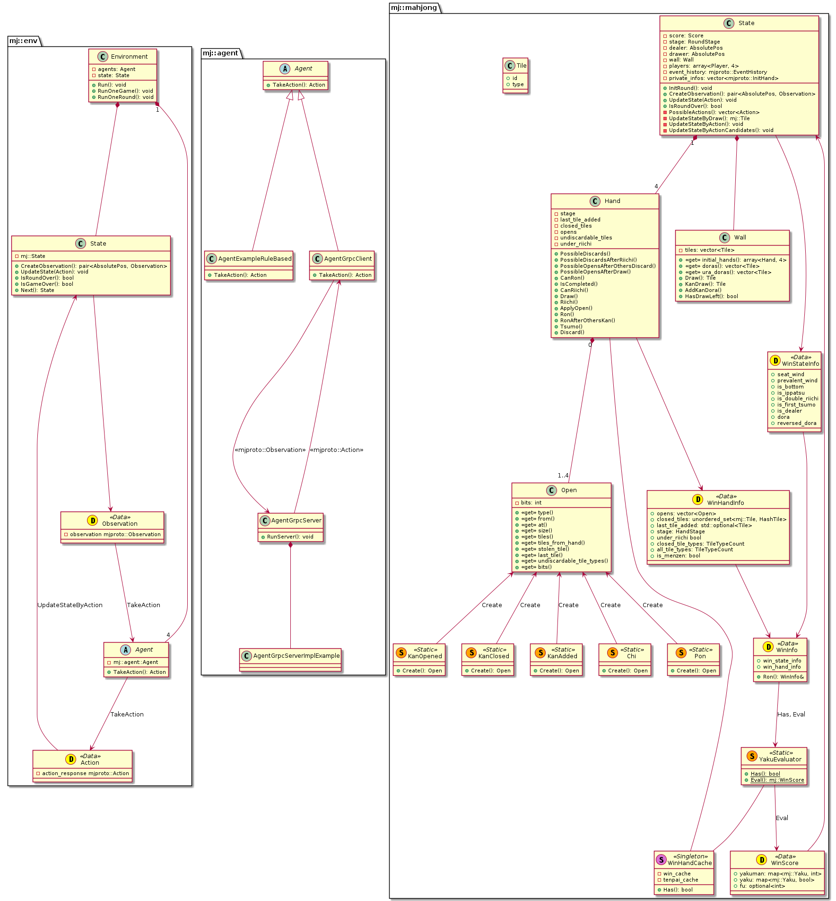
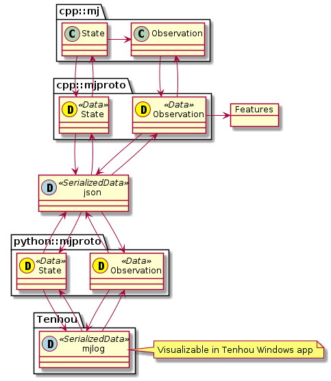
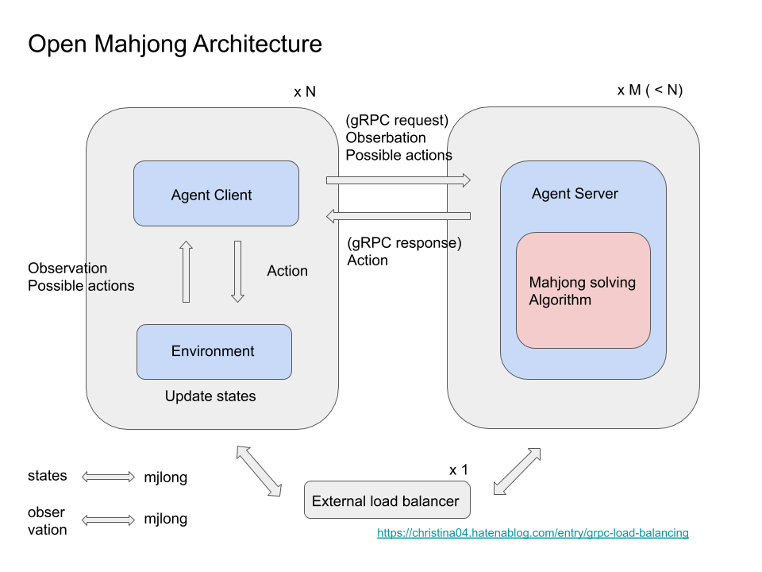

[](https://github.com/sotetsuk/mahjong/actions)

# Open Mahjong






[](https://docs.google.com/presentation/d/1lhb_sNix02Iyp0DI0Be5uuQub1W7CVbFiUdiDazG6tY/edit?usp=sharing)

## Build

ローカルの環境でビルド、テストする場合:

```
$ make build
$ make test
```

Dockerを使ってビルドする場合:

```
$ make docker-build
$ make docker-test
```

## Development

Clionを使ってローカル環境に依存せずにDockerコンテナ内で開発ができる。
まずコンテナを立ち上げる。このコマンドではポート2222を使用する。

```
$ make docker-clion-start
```

Clion側の設定は [clion/README.md](./clion/README.md) を参照。

## Usage

`mj/mj.h` をincludeすることで使用できる。

```cpp
#include <mjx/mjx.h>

int main() {
    auto t = mjx::Tile("m1");
    return 0;
}
```

## Tenhou/mjlog
天鳳から天鳳位などの牌譜をダウンロードすると、基本的に `.mjlog` という拡張子のファイルが得られる。これはそのままWindows版の天鳳で観戦することができる。このファイルの中身をテキストエディタ等で直接編集したい場合は、一度 `.gz` 形式になおしてから解凍する必要がある[[1](http://rausumaru.hatenablog.com/entry/2019/08/30/021154)]。名前の匿名表示のオンオフはプレミアム版で設定可能らしい（要確認）。

```sh
# cd mjlog_dir
$ for x in $(ls); do mv ${x} ${x}.gz; done
$ cd ../
$ gzip -dr mjlog_dir
```


## References

- [麻雀用語集スプレッドシート](https://docs.google.com/spreadsheets/d/e/2PACX-1vQyy10WqsUVxCCeamqTh3Oj4l72qdBkoXkUIbRp1nGecL_Co9St830kST7AvdJKh6ThlkHBA4Y1yi6T/pubhtml)
- Hand score calculation
  - [シャンテン数計算アルゴリズム](https://qiita.com/tomo_hxx/items/75b5f771285e1334c0a5)
    - [github.com/tomohxx/shanten-number-calculator](https://github.com/tomohxx/shanten-number-calculator)
  - [麻雀 和了判定（役の判定） アルゴリズム](http://hp.vector.co.jp/authors/VA046927/mjscore/mjalgorism.html)
  - [麻雀の数学](http://www10.plala.or.jp/rascalhp/mjmath.htm)
- Tenhou/mjlog
  - [mjlog形式について](http://m77.hatenablog.com/entry/2017/05/21/214529)
  - [NegativeMjark/tenhou-log](https://github.com/NegativeMjark/tenhou-log)
  - [mthrok/tenhou-log-utils](https://github.com/mthrok/tenhou-log-utils) mjlongのコンソールでの表示などができる
  - [天鳳牌譜(.mjlog形式)をXMLに直す](http://rausumaru.hatenablog.com/entry/2019/08/30/021154)
  - [github.com/tomohxx/tenhou-tile-wall](https://github.com/tomohxx/tenhou-tile-wall) 天鳳における牌山の生成プログラム
- Play at tenhou
  - [MahjongRepository/tenhou-python-bot](https://github.com/MahjongRepository/tenhou-python-bot)
  

